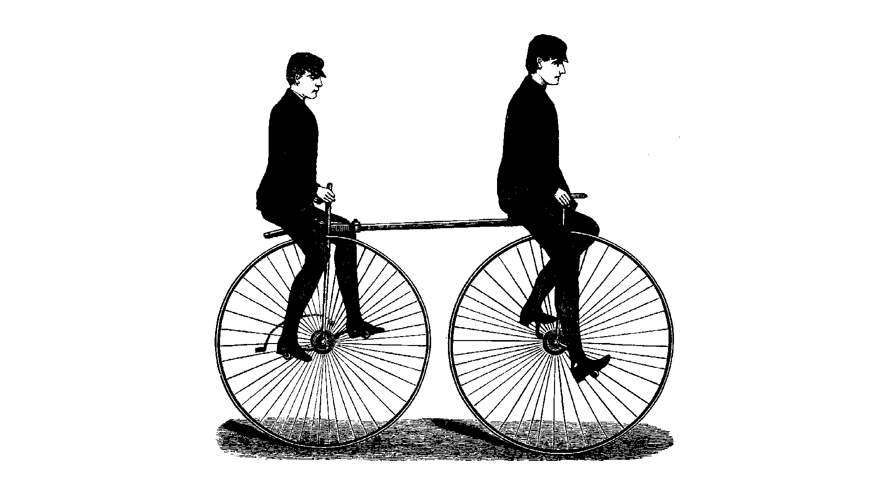

# Representing bicycle-based interaction

An interaction design exploration into bicycling research

by *Tim von Oldenburg*

^ Welcome to my thesis presentation, entitled “…”, which is also the title of my thesis project

* * *

## Context

### Bicycle-based interaction

^ Bicycling is a pretty wide field

^ You can cycle as a commute and for running errands, or for exercise, or just for fun; alone or in a group; as amateur or professional

^ As an interaction designer, there are a lot of things that you could be interested in…

* * *

### Related work

- Industry focuses mostly on low-interaction mobile apps (Strava, MapMyRide, …)
- Some academic IxD projects exist (*Cheng*, *Rowland*)
- Different foci: infrastructure, the bicycle itself, social interaction, community, environmental factors
- Most research into bicycling practice comes from urban planning and the social sciences

^ And taking a step back from my focus, I had a look at related work in the field of bicycling and design

* * *

### Focus

**Social interaction between bicyclists and others during chance encounters in urban traffic.**

- (Not only) random vèlomobile formations-in-action (*McIlvenny*)
- Most of these interactions are indirect, subtle, fleeting.
- They are **really hard to research**.

^ Found that out during my pilot experiment and early work on the thesis

^ My focus shifted from designing for chance encounters to researching chance encounters -> more towards methodology

^ Which led me to my research question and my methodological framing…

* * *

## Framework
### Representation, Reflection, Experiments

* * *

Research question

**How can we create representations that convey a richer account of the bicycling experience and use them to enquire more deeply into cycle-based interactions?**

* * *

### Representations

> Things are made visible so that they can be seen, talked about, and potentially, manipulated.

^ Visible here, means actually: perceivable

^ We only always get a representation of an experience; representations emphasise some aspects over others, and thus they are never objective/neutral

^ Representations help us grasp/understand the experience of someone else — or even our own

- Verbalised accounts: interviews, surveys
- Maps & diagrams
- Audio & Video

* * *

How have we been using representations in the past in bicycling research?

- Ethnography (*Aldred & Jungnickel*, *McIlvenny*)
- Interaction Analysis (*Jordan & Henderson*)
- *Spinney*: video as a way of ‘feeling there’ when you can’t be there; video as a way of apprehending fleeting moments of mobile experience; and video as a tool to extend sensory vocabularies

* * *

### Reflection

- Reflection through representation - don’t deny, but embrace the interpretive power of representations
- Reflection in situ - if possible, reflect on your (re)actions during the ride

^ I don’t just want to take the representation and put in on a shelf - but to use it together with the participant to help her reflect on her experience

^ Even with everything recorded, there is so much that cannot be captured just through whatever representation at hand -> think aloud

* * *

### Experimental research

* No formulated programme
* Not researching one special method, but explore different directions and see ‘what is possible’ in the space of research methods
* The experiments do not build on each other and have no temporal or causal relation

^ Except that they are supposed to go into different directions

^ Some are emphasised more than others; I focused more on videography than on the other two experiments

* * *

## Design experiments
### Soundscapes, Mapping, Videography

* * *

### A route’s soundscape(s)

#### Which qualities of a ride can be captured using simple audio recordings?

 

^ autoethnography

* * *

#### Reflection

- Audio can capture a mood/character of the ride, rather than pinpoint specific interactions
- One can identify patterns
- Events that deviate from the patterns are most interesting

^ Which might have to do with the fact that indirect interaction is mostly silent

* * *

### Mapping spaces for interaction

- Geolocation data from > 2500 bicycle rides in Malmo
- Find spaces of frequent travel
- Cross-reference with spaces of slow travel

^ Presumption: social interaction on the bicycle is mostly indirect and takes most likely place when people are slow or at a stop

^ Show map now

* * * 

^ Just with this instance of a map, one can play around for hours to find and interpret interesting spaces. And tweaking the settings for grid size etc, a researcher can spend days.

* * *

#### Reflection

- A simple yet powerful tool to find places of interest
- Serves as a basis for further research
- The data source is important
- The researcher’s interests and biases play into the mix

^ If you have the technical ability

^ For example, I could now go in and explore some of the spaces using ethnographic methods

* * *

### Videography experiment

* Extend *Interaction Analysis* through direct enquiry and an etic/external view
* Video ethnography (+ ride-along) and analysis with participant

^ I did this experiment in two iterations, but I will only present the second one

* * *

* Researcher rides behind participant
* Both have a camera mounted to their handlebars
* They are on a phone call using headsets

^ I asked her to think aloud during the ride

^ I could also make specific enquiries, ask her about things that I noticed

* * *

[Video]

^ As you can see, I assembled the two videos side by side, Luisa’s is on the left and mine is on the right

^ I removed the sound so I could talk over

* * *

#### Reflection

- We noticed subtle events that we would not have otherwise
- Ride-along is a challenge
- Not being an experienced ethnographer, it was difficult to come up with relevant, contextual enquiries

^ Added two components to the mix: the reflection in situ, and the researcher

^ And ‘otherwise’ meaning, if I wouldn’t have been there or we didn’t do the reflection in situ

* * *

## Conclusions & Outlook

^ Explored a space of possible methods to capture and represent bicycle-based interaction through experiments

^ These are by no means finished, polished methods

- I contributed to a repertoire of methods to enquire into bicycle-based interaction
- Mobile methods do not have to be completely new
- My experiments are by no means finished, polished methods

^ The method you need depends on what you research

^ We only have to tweak “particular methods capable of harnessing the power of existing methodologies in mobile situations” (*Shaw and Hesse in Spinney 2011, p. 164*)

* * *

Research question

**How can we create representations that convey a richer account of the bicycling experience and use them to enquire more deeply into cycle-based interactions?**

*For example* by:

- encouraging reflection-on-action in situ
- involving the researcher more actively
- using existing data set for quick analysis
- recording previously neglected qualities

* * *

### The future

- Which qualities of the bicycling experience are captured by our other senses?
- What role do emotion and affect play?
- Biosensing (GSR, EEG)
- IoT: research on a large scale and with low effort

* * *

# Thank you